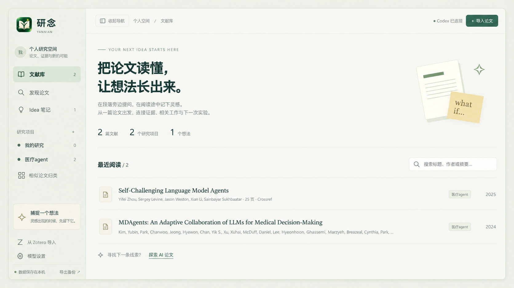
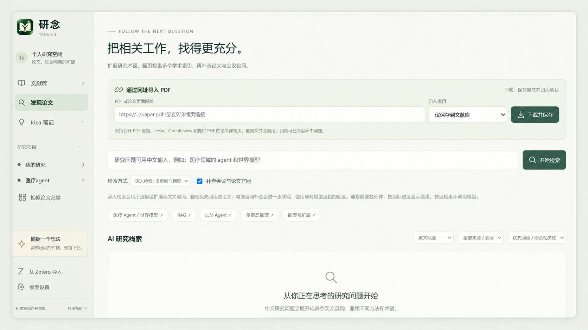
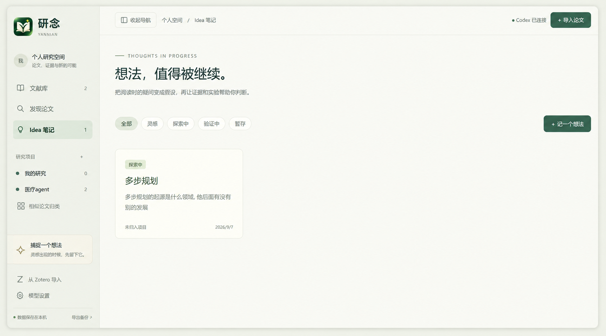

<p align="center">
  
</p>

<h1 align="center">研念 · Yannian</h1>
<p align="center"><strong>让阅读中的一念，成为研究的起点。</strong></p>
<p align="center">论文发现 · PDF 精读 · 选区问答 · 灵感记录 · 研究项目</p>

研念是一个面向 **AI 研究与论文精读的开源本地工作台**。从发现论文、下载原文，到选中一段文字或一张图提问，再到保存 idea、寻找相似工作与可用资源，把研究中相互关联的动作放在同一个空间里。

**A local research workspace for paper discovery, PDF reading, context-aware AI questions, and research ideas.** The current interface and guide are in Chinese.

[界面预览](#界面预览) · [快速开始](#快速开始) · [使用指南](docs/USER_GUIDE.md) · [验证记录](VERIFICATION.md) · [参与开发](CONTRIBUTING.md) · [更新日志](CHANGELOG.md)

## 为什么做研念

读论文时，问题往往来自一句话、一幅图或一个实验细节；idea 也往往在这个时候出现。研念把这些问题与灵感连回原文，让后续查证、比较和继续思考有据可循。

- **带着原文问**：在 PDF 上选择文字或框选图表、公式，直接向 AI 提问，省去手动复制与截图。
- **全文与联网核查**：默认参考整篇已解析文本；输入“联网搜寻细节”会触发联网，显示真实工具调用状态和原文覆盖范围。
- **接着上下文聊**：拖动分栏调整阅读与对话宽度；查看历史、停止回答，在输入框旁切换模型与思考深度。
- **把想法留下来**：idea 可以保存摘录、页码和选区，之后继续查相似工作、代码、数据集与验证方案。
- **围绕研究问题整理**：同一篇论文可加入多个项目；本地相似度和 AI 语义归类提供可调整的整理建议。
- **资料保存在本机**：文献、项目、对话与报告使用 SQLite 和本地文件保存，可导出备份。
- **模型连接可选**：支持本机 Codex、OpenAI、DeepSeek，以及兼容 Chat Completions / Responses 的其他服务和本地模型。

## 界面预览

### 文献库：让论文围绕研究问题积累

在同一个工作台查看最近阅读、研究项目与 idea，按标题、作者或摘要寻找文献，接着上次的线索继续读。



### 发现论文：从研究问题或一个网址开始

输入研究问题，展开多来源检索；也可以粘贴公开 PDF 或论文页面网址，下载原文并归入所选项目。



### idea 笔记：把阅读中的问题留下来

随时记下问题与假设，用“灵感、探索中、验证中、暂存”跟进想法的状态，为后续查证与实验留下起点。



以上展示图基于项目使用者提供的实际截图修整，移除了第三方悬浮窗，并统一裁剪、留白与外框。

## 功能一览

| 能力 | 怎么用 | 对研究的帮助 |
| --- | --- | --- |
| 多来源论文发现 | 输入中文或英文研究问题；深入检索展开英文查询，分页查询 arXiv、Semantic Scholar、Crossref，可补查论文官网 | 保留原始标题、来源、进度和失败信息，便于判断检索覆盖 |
| 网址下载与归类 | 在“发现论文”粘贴公开 PDF 直链或论文网页，选择项目后下载保存 | 减少下载、上传、归档之间的切换，重复文件可复用 |
| 原文 PDF 阅读 | 连续滚动、跳页、缩放；拖动分隔条调宽，独立调整阅读框位置，收起两侧栏 | 保留双栏、公式与图片的原始排版，集中阅读 |
| 文字与图表提问 | 拖选文字，或框选图片、公式与区域后发送问题；图片以小缩略图随消息滚动 | 提问绑定具体证据，历史对话可回到原页选区 |
| 持续 AI 对话 | Codex / Chat Completions 回答逐步显示，可停止、回看历史、查看上下文目录；直接切换模型和思考深度 | 同一论文换选区接着聊，保留部分回答、对话记录和输入草稿 |
| 项目式文献管理 | 手动加入项目，或查看并应用相似归类建议 | 围绕研究方向积累文献，一篇论文可属于多个项目 |
| 相似论文与阅读初筛 | 从研究关键词查找候选；深入检索整理优先阅读建议与相关性理由 | 帮助决定先读哪些论文，保留其余候选供继续筛选 |
| idea 笔记与分析 | 随时记录想法、保存原文关联，分析类似工作、资源和验证实验 | 将阅读线索延续为可检查的研究假设 |
| Zotero 本地导入 | 从已打开的 Zotero 选择文献，复制元数据和本机 PDF 附件 | 接续已有个人文献库 |
| 备份与迁移 | 导出 SQLite、PDF、JSON 和 idea Markdown | 本地资料可备份，也便于跨工具整理 |

## 一次典型使用

1. 创建一个研究项目，写下研究问题与关键词。
2. 在“发现论文”搜索，或粘贴论文网址，下载 PDF 并归入项目。
3. 打开原文，拖选不理解的段落，或框选图表，输入问题。
4. 将阅读中产生的想法“记为 idea”，保留对应原文位置。
5. 在 idea 页面分析类似工作、寻找代码和数据集，整理验证实验。
6. 回到项目比较论文与报告，定期导出备份。

详细操作、模型设置和常见限制见 [使用指南](docs/USER_GUIDE.md)。

## 快速开始

需要 **Python 3.11+** 和现代浏览器。提供 Windows、macOS、Linux 启动入口；首次自动建立环境与安装依赖，以后仅在依赖清单变化时更新，并复用正在运行的服务。Windows、Apple Silicon Mac、Intel Mac 和 Linux 已通过自动安装与启动检查，详见 [验证记录](VERIFICATION.md)。Node.js 仅用于开发测试，日常运行不需要。

### Windows

下载并解压项目，双击 `start.cmd`。首次运行会创建 `.venv`、安装依赖，并打开：

<http://127.0.0.1:8765>

需要桌面入口时，在项目目录执行：

```powershell
powershell -ExecutionPolicy Bypass -File create-desktop-shortcut.ps1
```

这会创建带 Logo 的 **“研念工作台”** 快捷方式。移动项目后需重新创建快捷方式。

### macOS（Apple Silicon / Intel）

1. 安装 [Python 3.11+](https://www.python.org/downloads/macos/)，解压项目到可写目录。
2. 双击 `start.command`；首次安装依赖后自动打开研念，以后双击同一文件快速启动。
3. 若下载解压后脚本没有执行权限，在终端进入项目目录执行一次：

```bash
chmod +x start.command start.sh
./start.command
```

也可始终使用 `bash start.sh`。若系统拦截下载的脚本，请按 macOS 提示确认来源后打开；无需关闭系统安全设置。可将 `start.command` 的替身放在桌面。移动项目后重建替身；从 Windows 迁移时保留 `data/`，不要复制 `.venv/`。

### Linux

安装 Python 3.11+ 与对应的 venv / pip 组件，在项目目录执行 `bash start.sh`。调试时使用 `bash start.sh --foreground`；只启动服务使用 `bash start.sh --no-browser`。

### 手动启动

Windows：

```powershell
python -m venv .venv
.\.venv\Scripts\python.exe -m pip install -r requirements.txt
.\.venv\Scripts\python.exe run.py
```

macOS / Linux：

```bash
python3 -m venv .venv
.venv/bin/python -m pip install -r requirements.txt
.venv/bin/python run.py
```

默认仅监听本机。端口冲突可给 `run.py` 添加 `--port 8766`；不自动打开浏览器可添加 `--no-browser`。

## 连接 AI

| 方式 | 准备 | 用量 |
| --- | --- | --- |
| 本机 Codex（默认） | 安装 Codex，以 ChatGPT 账户登录，在“模型设置”检测连接 | 使用该账户可用的 Codex 用量限制；无需另填 API Key |
| OpenAI API | 选择 OpenAI API，填写 Key 和可用模型；使用 Responses 协议 | 使用 API 账户，单独计费 |
| DeepSeek | 选择 DeepSeek，基础地址和模型自动填入；填写 Key 后保存并测试 | 使用 DeepSeek API 账户 |
| 其他兼容 API / 本地模型 | 填写基础地址、模型 ID 和密钥，选择 Chat Completions 或 Responses；本机免密服务可勾选不需要 Key | 按所选服务规则 |

DeepSeek 预设依据 [官方 API 文档](https://api-docs.deepseek.com/) 配置，默认 `deepseek-v4-flash`；也可手动填写模型或读取账户的 `/models` 列表。框选图片需使用视觉模型；其他服务可明确配置图片和思考参数支持。DeepSeek / 通用 Chat 接口不冒充联网搜索工具：论文索引检索正常运行，额外官网核查不可用时会说明。

研念通过官方 Codex App Server 与本机 Codex 通信。Codex 登录凭据由 Codex 管理；研念的论文对话由工作台保存，不会继承当前 Codex 窗口的聊天记忆。额度不足时会提示，不自动切换到 API。

PDF 阅读、选区保存、手动项目管理、网址下载、快速索引检索、idea 保存和备份不需要模型。AI 问答、深入检索中的模型步骤、语义归类及 idea 分析需要可用连接。

可将 `.env.example` 复制为 `.env` 设置本机配置。新配置名使用 `YANNIAN_CODEX_BIN`、`YANNIAN_PORT` 和 `YANNIAN_DATA_DIR`；旧版 `YANJI_*` 配置仍兼容。

## 数据与边界

默认研究资料保存在 `data/`，源码发布包不包含这个目录。

```text
data/
├── library.sqlite3    文献、项目、选区、对话、idea、报告与检索记录
├── papers/            原始 PDF
└── runtime/           后台启动日志
```

**本地保存不等于离线 AI。** 提问时，所需原文上下文、历史对话及选中的图像会发送给所选模型服务；检索和下载会访问外部论文来源。备份方式与数据恢复见 [使用指南](docs/USER_GUIDE.md#数据与恢复)。

当前版本为本地单人应用，尚不提供团队账户、跨设备同步或公网部署配置。另有以下限制：

- 检索与阅读初筛有查询、分页和候选范围，不是完整顶会索引；初筛基于标题与摘要，不等同于阅读全文。
- idea 分析是查证辅助；“没有搜到相同工作”不能证明创新性。
- PDF 尚无 OCR、跨页连续选区或自由手绘；扫描件可用矩形框选图像提问。单文件上限 40 MB / 500 页。
- Zotero 为本地单向导入，尚无双向同步、群组库和批注迁移。
- 阅读对话默认附入整篇已解析文本（单轮原文预算约 24 万字符），不受当前页限制；超过预算时在整篇中检索并显示部分覆盖，也可主动选择“检索相关段落”。文字提取不等于读取每张图像，尚无 OCR 或全文 embedding 索引。
- Codex / OpenAI Responses 可执行阅读联网核查；DeepSeek 和通用接口尚无联网工具，明确要求联网时会提示切换，保留问题草稿。Codex 与 Chat Completions 支持逐步回答；Responses 目前等待完整回答。

## 技术与开发

后端使用 **FastAPI + SQLite + PyMuPDF**，前端使用原生 JavaScript / CSS 和随项目提供的 **PDF.js**。模型通过本机 Codex App Server、Chat Completions 或 Responses API 接入。

```text
app/                HTTP API、存储、模型连接、检索、PDF 获取与选区
static/             中文工作台界面、PDF 阅读器、Logo 与第三方前端依赖
tests/              后端回归与前端源码单元检查
docs/               使用指南与 GitHub 发布说明
scripts/            干净源码包生成工具
run.py              前台开发启动入口
launch.pyw          后台启动与服务复用
```

测试命令见 [参与开发](CONTRIBUTING.md)，已完成的验证及未覆盖项见 [验证记录](VERIFICATION.md)。后续方向包括结构化 PDF 解析、跨论文语义检索、项目级对话与更完整的会议索引；这些是规划，尚未实现。

## 许可证

研念的原创代码采用 [AGPL-3.0-only](LICENSE)。第三方库及随附文件遵循各自许可证，详见 [第三方依赖说明](THIRD_PARTY.md)。

本项目独立开发，与 OpenAI、Zotero 及论文索引服务不存在官方隶属关系。
